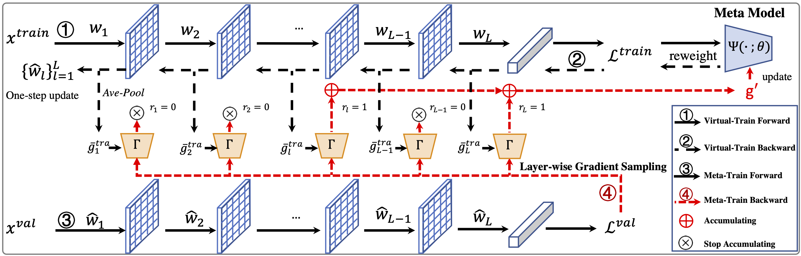

# FaMUS


## Paper
**Youjiang Xu**, Linchao Zhu, Lu Jiang, and Yi Yang. "Faster Meta Update Strategy for Noise-Robust Deep Learning." In *CVPR*, 2021.

- If this project is helpful, please cite the following paper:

```text
@inproceedings{Xu2021FaMUS,
  author    = {Xu, Youjiang and Zhu, Linchao and Jiang, Lu and Yang, Yi },
  title     = {Faster Meta Update Strategy for Noise-Robust Deep Learning},
  booktitle = {CVPR},
  year      = {2021},
}
```

- Download: [\[pdf\]](./paper/famus.pdf), [\[supp\]](./paper/famus-supp.pdf)

## Framework



## Code
- [todo]

## Dataset
- The TFRecord files of the CNWL dataset with 32x32 resolution can be downloaded [here]( https://drive.google.com/file/d/12KLkFaIDLlQ4bYIQL7xVeqX3H1d0r4_o/view?usp=sharing), and the implementation of the baseline method `MentorMix` can be found [here](./baselines/code_mentormix_r32/README.md). More details can refer to the [codebase](https://github.com/google-research/google-research/tree/master/mentormix).


## Contact
If you have any questions, please contact with ``youjiangxu@gmail.com`` without hesitation.
